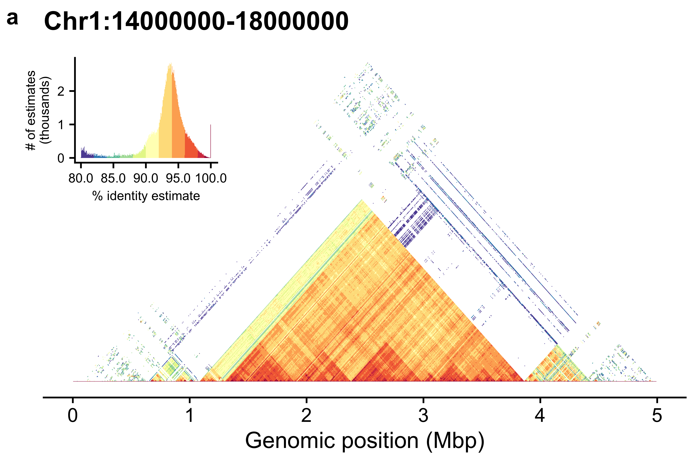

- [About](#about)
- [Installation](#installation)
- [Usage](#usage)
  - [Standard arguments](#standard-arguments)
  - [Static plots](#static-plots)
  - [Interactive Mode](#interactive-mode)
  - [Sample run - static plots](#sample-run---static-plots)
  - [Sample run - interactive mode](#sample-run---interactive-mode)
  - [Sample run - comparing two sequences](#sample-run---comparing-two-sequences)
- [Questions](#questions)
- [Known Issues](#known-issues)
- [Cite](#cite)

## About

Mod.Plot is a novel dot plot visualization tool used to view tandem repeats, similar to [StainedGlass](https://mrvollger.github.io/StainedGlass/). Mod.Plot utilizes modimizers to compute the Jaccard coefficient in order to estimate sequence identity. This significantly reduces the computational time required to produce these plots, enough to update in real time!


--- 

## Installation

```
git clone https://github.com/marbl/ModDotPlot.git
cd ModDotPlot
```

Although optional, it's recommended to setup a virtual environment before using Mod.Plot:

```
python -m venv venv
source venv/bin/activate
```

Once activated, you can install the required dependencies:

```
python setup.py install
```

--- 

## Usage

ModDotPlot requires at least one sequence in FASTA format:

```
moddotplot -i INPUT_FASTA_FILE(S)
```

--- 

### Standard arguments

`-k / --kmer <int>`

K-mer size to use. This should be large enough to distinguish unique k-mers with enough specificity, but not too large that sensitivity is removed. Must be 32 or less due to integer bit packing constraints. Default: 21.

`-s / --sparsity <int>`

A higher sparsity value means less k-mers to compare, at the expense of lower accuracy. Modimizers are selected `0 mod s`, an inverse of the selected k-mer density. The default is `s = 2/Mbp` of sequence for fast performance without compromising accuracy. For example, on a human Y chromosome ~ 64Mbp, Mod.Plot will set `s = 128`. Interactive mode will automatically round up to the nearest even integer. 

`-o / --output-dir <string>`

Name of output directory for bed file & plots. Default is current working directory.

`--identity <int>`

Identity cutoff threshold. Must be greater than 50, less than 100. Default is 80.

`resolution <int>`

Dotplot resolution. This corresponds to the number of partitions for each sequence. Default is 1000. 

`--alpha <float>`

Each partition takes into account a fraction of its neighboring partition;s k-mers. This is to avoid sub-optimal identity scores when partitons don't overlap identically. Default is 0.01.

`-nc / --non-canonical`

When counting k-mers, both forward and reverse complement are considered, with the smaller hash value selected. Using `-nc` will force selection of the forward strand only. This is not recommended for most applications.

--- 

### Static plots

By default, Mod.Plot will output a paired end bed file, along with plots for each sequence in each FASTA file as an image file (.png). 

`--no-bed`

Skip output of bed file.

`--no-plot`

Skip output of svg and png image files.

`--no-hist`

Skip output of histogram legend.

`--compare`

Produce an a vs. b style dotplot. Can only be used when 2+ sequences are included. 

`--compare-only`

Produce an a vs. b style dotplot without any individual dotplots.

`--width`

Adjust width of self dot plots. Default is 9 inches.

`--height`

Adjust height of self dot plots. Default is 5 inches for self-plots, 9 inches for a vs. b plots.

`--dpi`

Image resolution in dots per inch (not to be confiused with dotplot resolution). Default is 300.

`--palette`

List of accepted palettes can be found [here](https://jiffyclub.github.io/palettable/colorbrewer/). The syntax is to have the name of the palette, followed by an underscore with the number of colors, eg. `OrRd_8`. Default is `Spectral_11`.

`--palette-orientation`

Flip sequential order of color palette. Set to `-` by default for divergent palettes. 

`--bin-freq`

By default, histograms are evenly spaced based on the number of colors and the identity threshold. Select this argument to bin based on the frequency of observed identity values.

Although deprecated, there is an R script you can use to plot directly from a bed file. ggplot2 and cowplot are required. You can call this Rscript through the following: 

```
Rscript moddotplot/plot.r -b <BED_FILE> -p <OUTPUT_FOLDER>
```

With `--bin-freq` being an optional argument to specify histogram binning by frequency, as noted above.

--- 

### Interactive Mode

To run Mod.Plot in interactive mode, use:

```
moddotplot -i INPUT_FASTA_FILE(S) --interactive
```

This will launch a Dash application on your machine's localhost. Open any web browser and go to `http://127.0.0.1:<PORT_NUMBER>` to view the interactive plot. The default port number used by Dash is `8050`, but this can be customized using the `--port` command.

Running interactive mode on an HPC environment can be accomplished through the use of port forwarding. On your remote server, run Mod.Plot as normal:

```
moddotplot -i INPUT_FASTA_FILE(S) --interactive --port HPC_PORT_NUMBER
```

Then on your local machine, set up port forwarding run:

```
ssh -N -f -L LOCAL_PORT_NUMBER:127.0.0.1:HPC_PORT_NUMBER HPC@LOGIN.CREDENTIALS
```

You should now be able to view interactive mode using `http://127.0.0.1:<LOCAL_PORT_NUMBER>`. Note that your own HPC environment may have specific instructions and/or restrictions for setting up port forwarding.

--- 

### Sample run - static plots

```
$ moddotplot -i test/Chr1_cen.fa     

 _______  _______  ______                        _______  _        _______ _________
(       )(  ___  )(  __  \                      (  ____ )( \      (  ___  )\__   __/
| () () || (   ) || (  \  )                     | (    )|| (      | (   ) |   ) (   
| || || || |   | || |   ) |                     | (____)|| |      | |   | |   | |   
| |(_)| || |   | || |   | |   ___   ___ _____   |  _____)| |      | |   | |   | |   
| |   | || |   | || |   ) |  |   \ / _ \_   _|  | (      | |      | |   | |   | |   
| )   ( || (___) || (__/  )  | |) | (_) || |    | )      | (____/\| (___) |   | |   
|/     \|(_______)(______/   |___/ \___/ |_|    |/       (_______/(_______)   )_(   


Retrieving k-mers from Chr1:14000000-18000000.... 

Chr1:14000000-18000000 k-mers retrieved! 

Using s = 8. 

Computing self identity matrix for Chr1:14000000-18000000... 

Self identity matrix complete! Saved to Chr1:14000000-18000000.bed 

Creating plots... 

Plots created! 

Saving plots to Chr1:14000000-18000000.png... 

Chr1:14000000-18000000.png_TRI.png, Chr1:14000000-18000000.png_TRI.svg, Chr1:14000000-18000000.png_HIST.png and Chr1:14000000-18000000.png_HIST.svg, saved sucessfully. 
```


--- 

### Sample run - interactive mode

```
$ moddotplot -i test/Chr1_cen.fa -s 32 --identity 85 --interactive   

 _______  _______  ______                        _______  _        _______ _________
(       )(  ___  )(  __  \                      (  ____ )( \      (  ___  )\__   __/
| () () || (   ) || (  \  )                     | (    )|| (      | (   ) |   ) (   
| || || || |   | || |   ) |                     | (____)|| |      | |   | |   | |   
| |(_)| || |   | || |   | |   ___   ___ _____   |  _____)| |      | |   | |   | |   
| |   | || |   | || |   ) |  |   \ / _ \_   _|  | (      | |      | |   | |   | |   
| )   ( || (___) || (__/  )  | |) | (_) || |    | )      | (____/\| (___) |   | |   
|/     \|(_______)(______/   |___/ \___/ |_|    |/       (_______/(_______)   )_(     


Retrieving k-mers from Chr1:14000000-18000000.... 

Chr1:14000000-18000000 k-mers retrieved! 

Dash is running on http://127.0.0.1:8050/

 * Serving Flask app 'moddotplot.interactive'
```


The plotly plot can be navigated using the zoom (magnifying glass) and pan (hand) icons. The current plot can be downloaded as an image with the camera icon. Depending on sparsity value, plots may need some time to refresh. The plot can be reset by double-clicking or selecting the home button. Set the lock resolution button to prevent auto-scaling using modimizers.

### Sample run - comparing two sequences

ModDotPlot can produce an a vs. b style dotplot for each pairwise combination of input sequences. Use the `--compare` command liene argument to include these plots. If you want to skip the creation of self-identity plots, you can use `--compare-only`:

```
moddotplot -i test/chr14_segment.fa test/chr21_segment.fa -id 88 --compare-only

 _______  _______  ______                        _______  _        _______ _________
(       )(  ___  )(  __  \                      (  ____ )( \      (  ___  )\__   __/
| () () || (   ) || (  \  )                     | (    )|| (      | (   ) |   ) (   
| || || || |   | || |   ) |                     | (____)|| |      | |   | |   | |   
| |(_)| || |   | || |   | |   ___   ___ _____   |  _____)| |      | |   | |   | |   
| |   | || |   | || |   ) |  |   \ / _ \_   _|  | (      | |      | |   | |   | |   
| )   ( || (___) || (__/  )  | |) | (_) || |    | )      | (____/\| (___) |   | |   
|/     \|(_______)(______/   |___/ \___/ |_|    |/       (_______/(_______)   )_(   


Retrieving k-mers from chr14:2000000-5000000.... 

chr14:2000000-5000000 k-mers retrieved! 

Retrieving k-mers from chr21:2000000-5000000.... 

chr21:2000000-5000000 k-mers retrieved! 

Using s = 6. 

Computing chr14:2000000-5000000 vs. chr21:2000000-5000000... 

Success! Bed file output to chr14:2000000-5000000_chr21:2000000-5000000.bed 

Creating plots... 

chr14:2000000-5000000_chr21:2000000-5000000.png and chr14:2000000-5000000_chr21:2000000-5000000.svg saved sucessfully. 
```


--- 

## Questions

For bug reports or general usage questions, please raise a GitHub issue, or email asweete1 ~at~ jhu ~dot~ edu

--- 

## Known Issues

Mac users might encounter the following unexpected command line output:

`/bin/sh: lscpu: command not found`

This is a known issue with PlotNine, the Python plotting library used by ModDotPlot. This can be safely ignored.

Using `--compare` in interactive mode is noticeably slower than self-identity dotplotting. I'll be looking to optimize this functionality as soon as possible. 

---


## Cite

Publication in progress!
