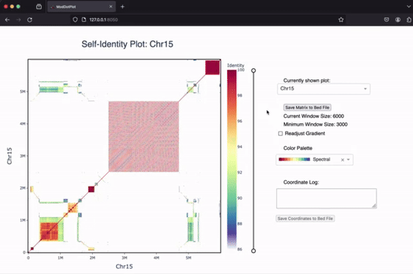
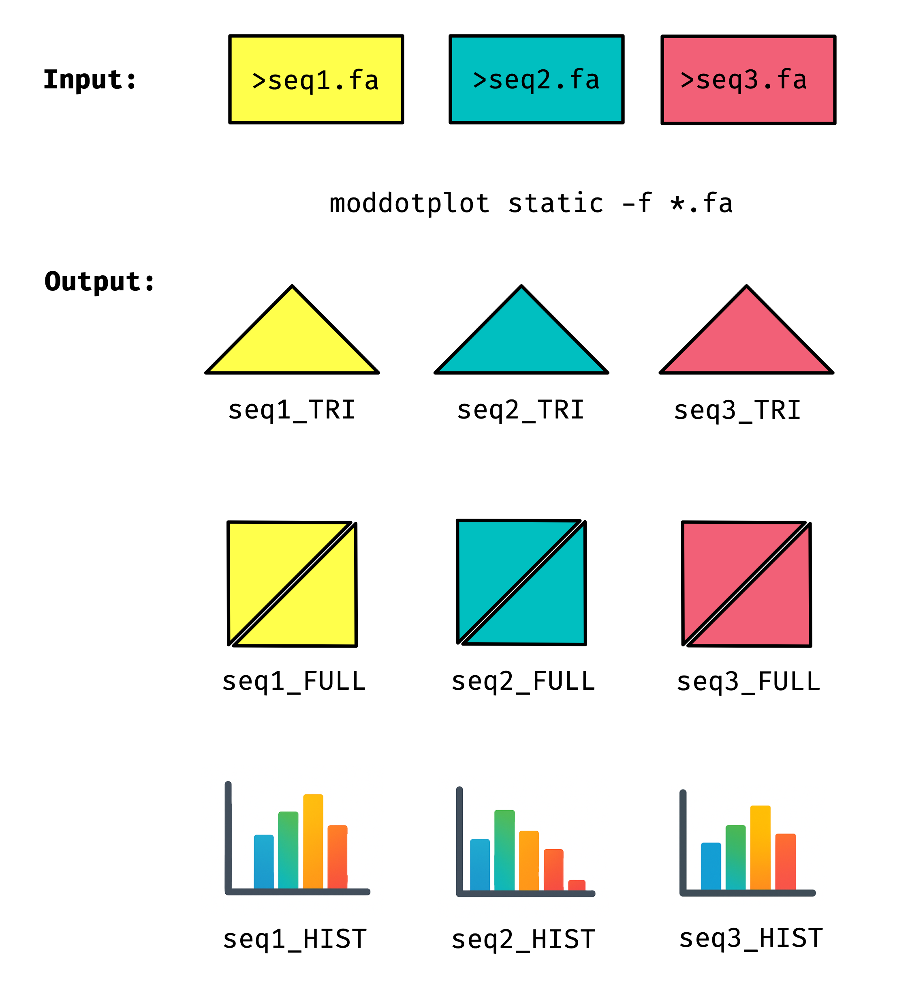
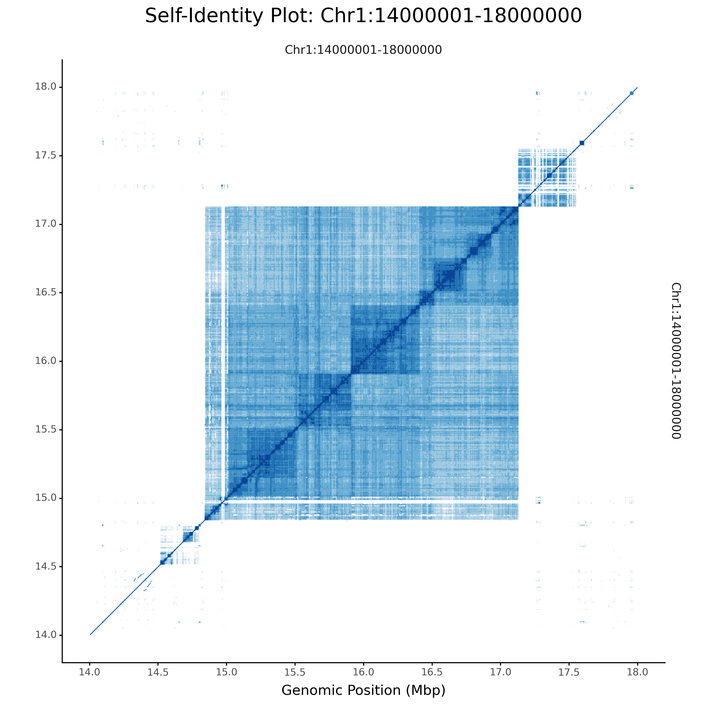
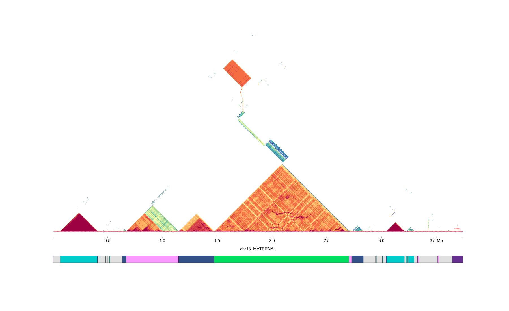
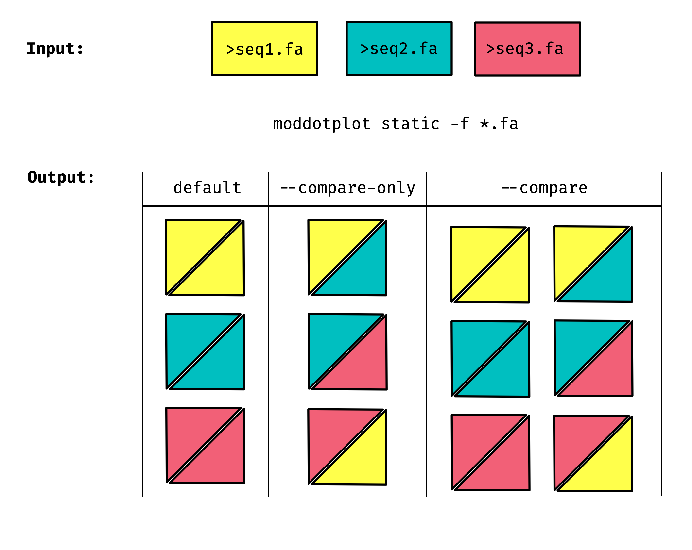
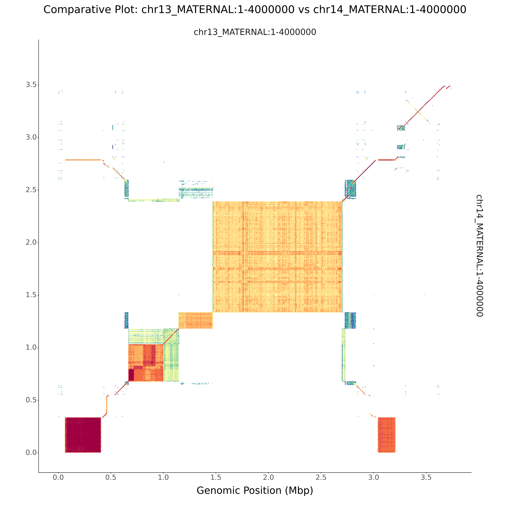
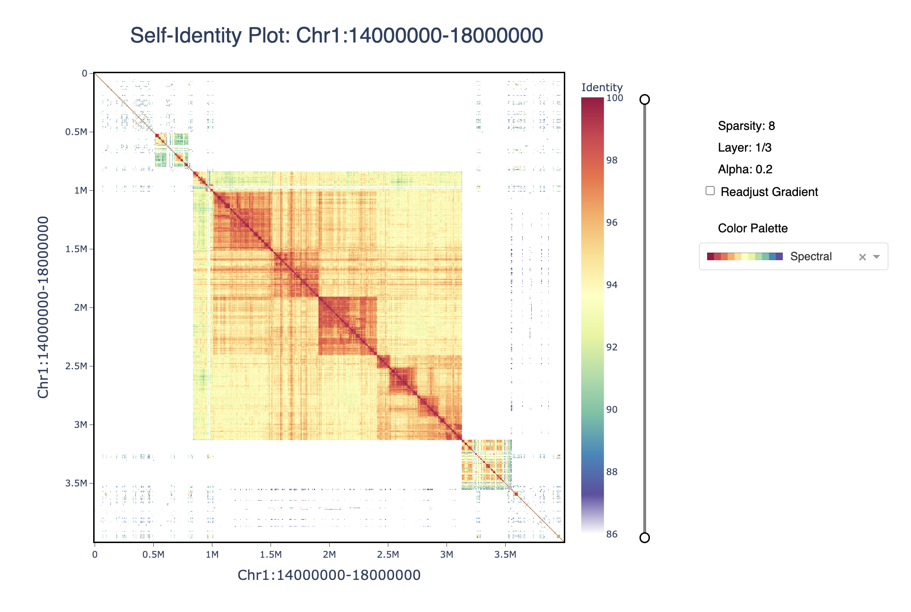

---
[](https://pypi.org/project/ModDotPlot/)
[](https://github.com/marbl/ModDotPlot/actions/workflows/black.yml)

- [](#)
- [Cite](#cite)
- [About](#about)
- [Installation](#installation)
- [Usage](#usage)
  - [Static Mode](#static-mode)
  - [Interactive Mode](#interactive-mode)
  - [Standard arguments](#standard-arguments)
  - [Static Mode Commands](#static-mode-commands)
    - [Input/Output \& Formatting Commands](#inputoutput--formatting-commands)
    - [Plot Customization Commands](#plot-customization-commands)
  - [Sample run - Static Plots](#sample-run---static-plots)
    - [Using a config file](#using-a-config-file)
    - [Adding custom bed file annotations](#adding-custom-bed-file-annotations)
    - [Comparing two sequences](#comparing-two-sequences)
  - [Interactive Mode Commands](#interactive-mode-commands)
  - [Sample run - Interactive Mode](#sample-run---interactive-mode)
  - [Sample run - Port Forwarding](#sample-run---port-forwarding)
- [Questions](#questions)
- [Known Issues](#known-issues)


## Cite

Alexander P Sweeten, Michael C Schatz, Adam M Phillippy, ModDotPlot—rapid and interactive visualization of tandem repeats, Bioinformatics, Volume 40, Issue 8, August 2024, btae493, [https://doi.org/10.1093/bioinformatics/btae493](https://doi.org/10.1093/bioinformatics/btae493)

If you use ModDotPlot for your research, please cite our software!

---

## About

_ModDotPlot_ is a dot plot visualization tool designed for large sequences and whole genomes. _ModDotPlot_ is the spiritual successor to [StainedGlass](https://mrvollger.github.io/StainedGlass/). The core algorithm breaks an input sequence down into intervals of sketched *k*-mers called **mod**imizers, and rapidly approximating the Average Nucleotide Identity between pairwise combinations of these intervals. This significantly reduces the computational time required to produce these plots, enough to view multiple layers of resolution in real time!



If you're interested in learning more about ModDotPlot and tandem repeats, you can watch my in-depth [YouTube video tutorial](https://www.youtube.com/watch?v=_7sQaljB_ys&t=2321s&pp=ygUXYWxleCBzd2VldGVuIG1vZGRvdHBsb3Q%3D) from the [BioDiversity Genomics Academy](https://thebgacademy.org).

--- 

## Installation

_ModDotPlot_ can be installed by running `pip install moddotplot`. It requires Python 3.7+ to run. Alternatively, you can download the current release from GitHub by using:

```
git clone https://github.com/marbl/ModDotPlot.git
cd ModDotPlot
```

Although optional, it's recommended to setup a virtual environment before using _ModDotPlot_:

```
python -m venv venv
source venv/bin/activate
```

Once activated, you can install the required dependencies:

```
python -m pip install .
```

Finally, confirm that the installation was installed correctly and that your version is up to date by running `moddotplot -h`:
```       
  __  __           _   _____        _     _____  _       _   
 |  \/  |         | | |  __ \      | |   |  __ \| |     | |  
 | \  / | ___   __| | | |  | | ___ | |_  | |__) | | ___ | |_ 
 | |\/| |/ _ \ / _` | | |  | |/ _ \| __| |  ___/| |/ _ \| __|
 | |  | | (_) | (_| | | |__| | (_) | |_  | |    | | (_) | |_ 
 |_|  |_|\___/ \__,_| |_____/ \___/ \__| |_|    |_|\___/ \__|

 v0.9.7

usage: moddotplot [-h] {interactive,static} ...

ModDotPlot: Visualization of Complex Repeat Structures

positional arguments:
  {interactive,static}  Choose mode: interactive or static
    interactive         Interactive mode commands
    static              Static mode commands

options:
  -h, --help            show this help message and exit`
  ```
--- 

## Usage

_ModDotPlot_ must be run either in `static` mode, or `interactive` mode:

### Static Mode

```
moddotplot static <ARGS>
```

Running _ModDotPlot_ in static mode quickly create plots under the specified output directory `-o`. By default, running _ModDotPlot_ in static mode this will produce the following files:

- A paired-end bed file `.bedpe`, containing intervals alongside their corresponding identity estimates.
- A self-identity dotplot for each sequence, as both an upper triangle matrix `_TRI` and full matrix `_FULL` representation.
- A histogram of identity values for each sequence.



All plots and histograms are output in a vectorized (default: `.svg`) and rasterized `.png` image. [Plotnine](https://plotnine.readthedocs.io/en/v0.12.4/) is the Python plotting library used, with [CairoSVG](https://cairosvg.org) used for converting between image formats.

_ModDotPlot_ supports highly customizable plotting features in static mode. See [static mode commands](#static-mode-commands) for a complete list of features.


### Interactive Mode

```
moddotplot interactive <ARGS>
```

Running _ModDotPlot_ in interactive mode will launch a [Dash application](https://plotly.com/dash/) on your machine's localhost. Open any web browser and go to `http://127.0.0.1:<PORT_NUMBER>` to view the interactive plot (this should happen automatically, but depending on your environment you might need to copy and paste this URL into your web browser). Running `Ctrl+C` on the command line will exit the Dash application. The default port number used by Dash is `8050`, but this can be customized using the `--port` command (see [interactive mode commands](#interactive-mode-commands) for further info).

--- 

### Standard arguments

The following arguments are the same in both interactive and static mode:

`-f / --fasta <file>`

Fasta files to input. Multifasta files are accepted. Interactive mode will only support a maximum of two sequences at a time.

`-b / --bed <.bed file>`

Input bedfile used for dotplot annotation (note: this is not the same as the paired-end bed file produced by ModDotPlot). If selected, this will produce an annotated bedtrack image `_ANNOTATION_TRACK.svg` in static mode, and open an IGV js track in the interactive mode Dash application. The name in the bedfile must match the name of the fasta sequence header in order to produce a correct bed track.

`-k / --kmer <int>`

K-mer size to use. This should be large enough to distinguish unique k-mers with enough specificity, but not too large that sensitivity is removed. Default: 21.

`-o / --output-dir <string>`

Name of output directory for bed file & plots. Default is current working directory.

`-id / --identity <int>`

Minimum sequence identity cutoff threshold. Default is 86. While it is possible to go as low as 50% sequence identity, anything below 80% is not recommended. 

`--delta <float>`

Each partition takes into account a fraction of its neighboring partitions k-mers. This is to avoid sub-optimal identity scores when partitons don't overlap identically. Default is 0.5, and the accepted range is between 0 and 1. Anything greater than 0.5 is not recommended.

`-m / --modimizer <int>`

Modimizer sketch size. Must be lower than window size `w`. A lower sketch size means less k-mers to compare (and faster runtime), at the expense of lower accuracy. Recommended to be kept >= 1000.

`-r / --resolution <int>`

Dotplot resolution. This corresponds to the number of windows each input sequence is partitioned into. Default is 1000. Overrides the `--window` parameter.

`--compare <bool>`

If set when 2 or more sequences are input into ModDotPlot, this will show an A vs. B style plot, in addition to a self-identity plot. Note that interactive mode currently only supports a maximum of two sequences. If more than two sequences are input, only the first two will be shown.

`--compare-only <bool>`

If set when 2 or more sequences are input into ModDotPlot, this will show an A vs. B style plot, without showing self-identity plots.

`--ambiguous <bool>`

By default, k-mers that are homopolymers of ambiguous IUPAC codes (eg. NNNNNNNNNNN’s) are excluded from identity estimation. This results in gaps along the central diagonal for these regions.  If desired, these can be kept by setting the `—-ambiguous` flag in both interactive and static mode. 

--- 

### Static Mode Commands

#### Input/Output & Formatting Commands

`-l / --load <.bedpe file>`

Create a plot from a previously computed pairwise bed file. Skips Average Nucleotide Identity computation. Used instead of `-f/--fasta`. Will only accept paired-end bed files produced by ModDotPlot. 

`-c / --config <.json file>`

Run moddotplot static with a config file instead of command line args. Example syntax in `config/config.json`. Recommended when creating a really customized plot. Used instead of -f/--fasta.

`--cooler <bool>`

If set, will output a matrix as a cooler file for each input sequence, in addition to a bedpe file.

`--no-bedpe <bool>`

Skip output of bed file.

`--no-hist <bool>`

Skip output of histogram legend.

`--no-plot <bool>`

Save .bedpe to file, but skip rendering of plots.

`--width <int>`

Adjust width of self dot plots. Default is 9 inches.

`--dpi <int>`

Image resolution in dots per inch (not to be confused with dotplot resolution). Default is `300`.

`--vector <str>` 

Vectorized image format to output to. Must be one of ["svg", "pdf", "ps"]. Default: `svg`

`--deraster <bool>`

By default, vectorized outputs rasterize the actual dotplot (not the axis). This is done to save space, as a high-resolution dotplot can be extremely space inefficient and prevent use of image manipulation software. This plot rasterization can be removed using this flag. 

#### Plot Customization Commands

`-w / --window <int>`

Window size. Unlike interactive mode, only one matrix will be created, so this represents the *only* window size. Default is set to `n/1000` (eg. 3000bp for a 3Mbp sequence). 

`--palette <str>`

List of accepted palettes can be found [here](https://jiffyclub.github.io/palettable/colorbrewer/). The syntax is to have the name of the palette, followed by an underscore with the number of colors, eg. `OrRd_8`. Default is `Spectral_11`.

`--palette-orientation <bool>`

Flip sequential order of color palette. Set to `-` by default for divergent palettes. 

`--color <list of hexcodes>`

List of custom colors in hexcode format can be entered sequentially, mapped from low to high identity. 

`--breakpoints <list of ints>`

Add custom identity threshold breakpoints. Note that the number of breakpoints must be equal to the number of colors + 1.

`-t / --axes-ticks <list of ints>`

Custom tickmarks for x and y axis. Values outside of the `--axes-limits` will not be shown. 

`-a / --axes-limits <int>`

Change axis limits for x and y axis. Useful when comparing multiple plots, allowing them to stay in scale. 

`--bin-freq <bool>`

By default, histograms are evenly spaced based on the number of colors and the identity threshold. Select this argument to bin based on the frequency of observed identity values.

### Sample run - Static Plots

#### Using a config file

When running _ModDotPlot_ to produce static plots, it is recommended to use a config file. The config file is provided in JSON, and accepts the same syntax as the command line arguments shown above. Here is an sample run using a centromeric sequence of _Arabadopsis thaliana_:

```
$ cat config/config.json

{
    "identity": 90,
    "palette": "Blues_7",
    "breakpoints": [
        90,
        91,
        92,
        93,
        96,
        98,
        99,
        100
    ],
    "output_dir": "Arabadopsis",
    "fasta": [
        "sequences/Arabadopsis_chr1_centromere.fa"
    ]
}
```

```
$ moddotplot static -c config/config.json               
  __  __           _   _____        _     _____  _       _   
 |  \/  |         | | |  __ \      | |   |  __ \| |     | |  
 | \  / | ___   __| | | |  | | ___ | |_  | |__) | | ___ | |_ 
 | |\/| |/ _ \ / _` | | |  | |/ _ \| __| |  ___/| |/ _ \| __|
 | |  | | (_) | (_| | | |__| | (_) | |_  | |    | | (_) | |_ 
 |_|  |_|\___/ \__,_| |_____/ \___/ \__| |_|    |_|\___/ \__|

Running ModDotPlot in static mode

Retrieving k-mers from Chr1:14000001-18000000.... 

Progress: |████████████████████████████████████████| 100.0% Completed

Chr1:14000001-18000000 k-mers retrieved! 

Computing self identity matrix for Chr1:14000001-18000000... 

        Sequence length n: 4000000

        Window size w: 4000

        Modimizer sketch size: 1000

        Plot Resolution r: 1000

Progress: |████████████████████████████████████████| 100.0% Completed


Saved self-identity matrix as a paired-end bed file to Arabadopsis/Chr1:14000001-18000000/Chr1:14000001-18000000.bedpe

Triangle plots, full plots, and histogram for Arabadopsis/Chr1:14000001-18000000/Chr1:14000001-18000000 saved sucessfully.
```


Using `samtools faidx` will result in a genomic range being added to a fasta file's header (eg. in the above sequence, the header is Chr1:14000001-18000000). _ModDotPlot_ will parse this syntax to add the appropriate axis.

#### Adding custom bed file annotations

If providing a custom annotation file using `--bed/b`, _ModDotPlot_ will output additional files:

- An annotation track `_ANNOTATION_TRACK`, containing . Colors for ranges are set using the 9th column of the bedfile.
- The annotation track overlayed with a self-identity dotplot `_ANNOTATED` for each sequence present in the annotation track.

```
$ moddotplot static -f sequences/HG002_chr13_MATERNAL:1-4000000.fa -b config/hg002v1.1.cenSatv2.0.bed
  __  __           _   _____        _     _____  _       _   
 |  \/  |         | | |  __ \      | |   |  __ \| |     | |  
 | \  / | ___   __| | | |  | | ___ | |_  | |__) | | ___ | |_ 
 | |\/| |/ _ \ / _` | | |  | |/ _ \| __| |  ___/| |/ _ \| __|
 | |  | | (_) | (_| | | |__| | (_) | |_  | |    | | (_) | |_ 
 |_|  |_|\___/ \__,_| |_____/ \___/ \__| |_|    |_|\___/ \__|

Running ModDotPlot in static mode

...

Annotation track saved to chr13_MATERNAL:1-4000000/chr13_MATERNAL:1-4000000_ANNOTATION_TRACK

Triangle plots, full plots, and histogram for chr13_MATERNAL:1-4000000/chr13_MATERNAL:1-4000000 saved sucessfully. 

```



#### Comparing two sequences



ModDotPlot can produce an a vs. b style dotplot for each pairwise combination of input sequences. Use the `--compare` command line argument to include these plots. When running `--compare` in interactive mode, a dropdown menu will appear, allowing the user to switch between self-identity and pairwise plots. Note that a maximum of two sequences are allowed in interactive mode. If you want to skip the creation of self-identity plots, you can use `--compare-only`:

```
moddotplot static -f sequences/*_MATERNAL*.fa --compare-only
```



--- 

### Interactive Mode Commands

`--port <int>`

Port to display ModDotPlot on. Default is 8050, this can be changed to any accepted port. 

`-w / --window <int>`

Minimum window size. By default, interactive mode sets a minimum window size based on the sequence length `n/2000` (eg. a 3Mbp sequence will have a 1500bp window). The maximum window size will always be set to `n/1000` (3000bp under the same example). This means that 2 matrices will be created.

`-q / --quick <bool>`

This will automatically run interactive mode with a minimum window size equal to the maximum window size (`n/1000`). This will result in a quick launch, however the resolution of the plot will not improve upon zooming in.

`-s / --save <bool>`

Save the matrices produced in interactive mode. By default, a folder called `interactive_matrices` will be saved in `--output_dir`, containing each matrix in compressed NumPy format, as well as metadata for each matrix in a pickle. Modifying the files in `interactive_matrices` will cause errors when attempting to load them in the future.

`--no-plot <bool>`

Save .bedpe to file, but skip rendering of plots. Must be used with `--save`.

`-l / --load <directory>`

Load previously saved matrices. Used instead of `-f/--fasta`.


--- 

### Sample run - Interactive Mode

```
$ moddotplot interactive -f sequences/Chr1_cen.fa     

  __  __           _   _____        _     _____  _       _   
 |  \/  |         | | |  __ \      | |   |  __ \| |     | |  
 | \  / | ___   __| | | |  | | ___ | |_  | |__) | | ___ | |_ 
 | |\/| |/ _ \ / _` | | |  | |/ _ \| __| |  ___/| |/ _ \| __|
 | |  | | (_) | (_| | | |__| | (_) | |_  | |    | | (_) | |_ 
 |_|  |_|\___/ \__,_| |_____/ \___/ \__| |_|    |_|\___/ \__|

Running ModDotPlot in interactive mode

Retrieving k-mers from Chr1:14000000-18000000.... 

Progress: |████████████████████████████████████████| 100.0% Completed

Chr1:14000000-18000000 k-mers retrieved! 

Building self-identity matrices for Chr1:14000000-18000000, using a minimum window size of 2000.... 

Layer 1 using window length 2000

Progress: |████████████████████████████████████████| 100.0% Completed


Layer 2 using window length 4000

Progress: |████████████████████████████████████████| 100.0% Completed


ModDotPlot interactive mode is successfully running on http://127.0.0.1:8050/ 

Dash is running on http://127.0.0.1:8050/
```



The plotly plot can be navigated using the zoom (magnifying glass) and pan (hand) icons. The plot can be reset by double-clicking or selecting the home button. The identity threshold can be modified by seelcting the slider. Colors can be readjusted according to the same gradient based on the new identity levels. 

### Sample run - Port Forwarding

Running interactive mode on an HPC environment can be accomplished through the use of port forwarding. On your remote server, run ModDotPlot as normal:

```
moddotplot interactive -f INPUT_FASTA_FILE(S) --port HPC_PORT_NUMBER
```

Then on your local machine, set up a port forwarding tunnel:

```
ssh -N -f -L <LOCAL_PORT_NUMBER>:127.0.0.1:<HPC_PORT_NUMBER> HPC@LOGIN.CREDENTIALS
```

You should now be able to view interactive mode using `http://127.0.0.1:<LOCAL_PORT_NUMBER>`. Note that your own HPC environment may have specific instructions and/or restrictions for setting up port forwarding.

VSCode now has automatic port forwarding built into the terminal menu. See [VSCode documentation](https://code.visualstudio.com/docs/editor/port-forwarding) for further details 


--- 

## Questions

For bug reports or general usage questions, please raise a GitHub issue, or email alex ~dot~ sweeten ~at~ nih ~dot~ gov

--- 

## Known Issues

- Mac users might encounter the following unexpected command line output: `/bin/sh: lscpu: command not found`. This is a known issue with Plotnine, the Python plotting library used by ModDotPlot. This can be safely ignored.

- If you encounter an error with the following traceback: `rv = reductor(4) TypeError: cannot pickle 'generator' object`, ths means that you have a newer version of Plotnine that is incompatible with ModDotPlot. Please uninstall plotnine and reinstall version 0.12.4 `pip install plotnine==0.12.4`. 
