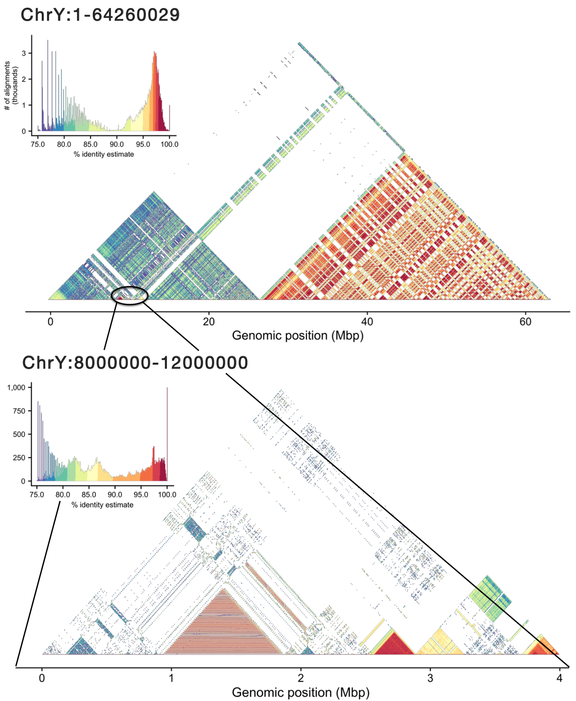

## Mod.Plot

Mod.Plot is a novel dot plot visualization tool used to view tandem repeats, similar to [StainedGlass](https://docs.google.com/presentation/d/1SR833K-a2alIDtXVuyav_y33SVZ-0N3x/edit?usp=sharing&ouid=116747761671966787462&rtpof=true&sd=true). Mod.Plot utilizes modimizers to significantly reduce the computational time to produce these plots.

View our [Biological Data Science poster](https://docs.google.com/presentation/d/1SR833K-a2alIDtXVuyav_y33SVZ-0N3x/edit?usp=sharing&ouid=116747761671966787462&rtpof=true&sd=true)!



## Installation

`git clone https://github.com/marbl/ModDotPlot.git`

`cd ModDotPlot`

Although optional, it's recommended to setup a virtual environment before using Mod.Plot:

`python -m venv venv`

`source venv/bin/activate`

Once activated, you can install the reuqired dependencies:

`python setup.py install`

## Usage

ModDotPlot requires at least one sequence in FASTA format:

`moddotplot -i INPUT_FASTA_FILE(S)`

### Standard arguments:

`-k / --kmer`

K-mer size to use. This should be large enough to distinguish unique k-mers with enough specificity, but not too large that sensitivity is removed. Recommended amount is between 15 and 21. Must be 32 or less.

`-d / --density`

This is the value used selecting modimizers using `0 mod d`, an inverse of the selected k-mer density. A lower value will be more accurate, at the expense of longer plotting time & longer refresh rates in interactive mode. The default is `d = 2/Mbp` of sequence for fast performance without compromising accuracy. For example, on a human Y chromosome ~ 64Mbp, Mod.Plot will set `d = 128`. Interactive mode will automatically round up to the nearest even integer. 

`-o / --output`

Name of output bed file & plots. Default is name of input fasta.

### Interactive Mode

To run Mod.Plot in interactive mode, use:

`moddotplot -i INPUT_FASTA_FILE(S) --interactive`

This will launch a Dash application on your machine's localhost. Open any web browser and go to `http://127.0.0.1:<PORT_NUMBER>` to view the interactive plot. The default port number used by Dash is `8050`, but this can be customized using the `--port` command.

Running interactive mode on an HPC environment can be accomplished through the use of port forwarding. On your HPC environment, run Mod.Plot as normal:

`moddotplot -i INPUT_FASTA_FILE(S) --interactive --port HPC_PORT_NUMBER`

Then on your local machine, set up port forwarding run:

`ssh -N -f -L LOCAL_PORT_NUMBER:127.0.0.1:HPC_PORT_NUMBER HPC@LOGIN.CREDENTIALS`

You should now be able to view interactive mode using `http://127.0.0.1:<LOCAL_PORT_NUMBER>`. Note that your own HPC environemnt may have specific instructions and/or restrictions for setting up port forwarding.

### Sample run:

```
$ moddotplot -i test/Chr1_cen.fa     

 _______  _______  ______          _______  _        _______ _________
(       )(  ___  )(  __  \        (  ____ )( \      (  ___  )\__   __/
| () () || (   ) || (  \  )       | (    )|| (      | (   ) |   ) (   
| || || || |   | || |   ) |       | (____)|| |      | |   | |   | |   
| |(_)| || |   | || |   | |       |  _____)| |      | |   | |   | |   
| |   | || |   | || |   ) |       | (      | |      | |   | |   | |   
| )   ( || (___) || (__/  )   _   | )      | (____/\| (___) |   | |   
|/     \|(_______)(______/   (_)  |/       (_______/(_______)   )_(   


Retrieving k-mers from Chr1:14000000-18000000.... 

Chr1:14000000-18000000 k-mers retrieved! 

Computing modimizers for Chr1:14000000-18000000... 

- Density not provided. Genome size ~ 4Mbp. Using d = 8. 

Modimizers done! 

Creating coordinates...

Coordinates done! 

Computing identity... 

Identity matrix complete! Bed file output

Saving plots...

Plots saved!
```