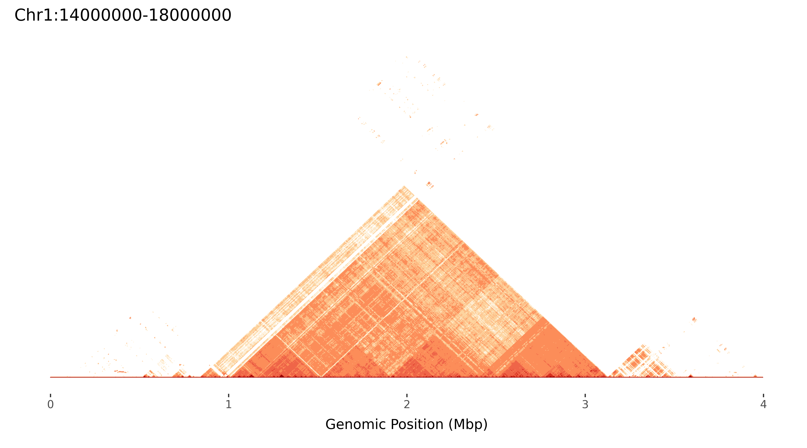
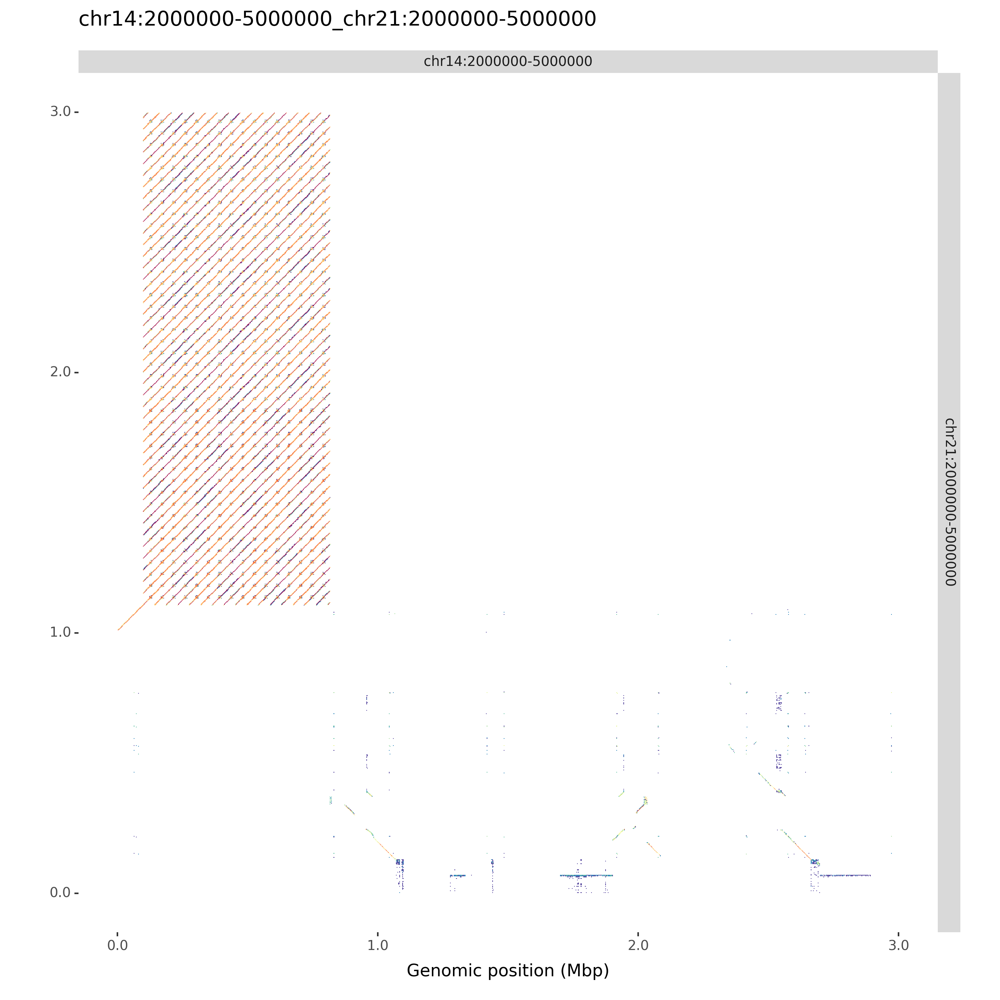

- [About](#about)
- [Installation](#installation)
- [Usage](#usage)
  - [Standard arguments](#standard-arguments)
  - [Interactive Mode Commands](#interactive-mode-commands)
  - [Static Mode Commands](#static-mode-commands)
  - [Sample run - Interactive Mode](#sample-run---interactive-mode)
  - [Sample run - static plots](#sample-run---static-plots)
  - [Sample run - comparing two sequences](#sample-run---comparing-two-sequences)
- [Questions](#questions)
- [Known Issues](#known-issues)
- [Cite](#cite)

## About

ModDotPlot is a novel dot plot visualization tool, similar to [StainedGlass](https://mrvollger.github.io/StainedGlass/). ModDotPlot utilizes modimizers to compute a modified version of the [Mash Containment Score](https://genomebiology.biomedcentral.com/articles/10.1186/s13059-019-1841-x) in order to rapidly estimate sequence identity. This significantly reduces the computational time required to produce these plots, enough to view multiple layers of resolution in real time!


--- 

## Installation

```
git clone https://github.com/marbl/ModDotPlot.git
cd ModDotPlot
```

Although optional, it's recommended to setup a virtual environment before using ModDotPlot:

```
python -m venv venv
source venv/bin/activate
```

Once activated, you can install the required dependencies:

```
python setup.py install
```

--- 

## Usage

ModDotPlot requires at least one sequence in FASTA format:

```
moddotplot -i INPUT_FASTA_FILE(S)
```

This will launch a Dash application on your machine's localhost. Open any web browser and go to `http://127.0.0.1:<PORT_NUMBER>` to view the interactive plot. The default port number used by Dash is `8050`, but this can be customized using the `--port` command (see [interactive mode commands](#interactive-mode-commands) for further info).

--- 

### Standard arguments

`-k / --kmer <int>`

K-mer size to use. This should be large enough to distinguish unique k-mers with enough specificity, but not too large that sensitivity is removed. Default: 21.

`-s / --sparsity <int>`

A higher sparsity value means less k-mers to compare, at the expense of lower accuracy. Modimizers are selected `0 mod s`, an inverse of the selected k-mer density. The default is `s = 2/Mbp` of sequence for fast performance without compromising accuracy. For example, on a human Y chromosome ~ 62Mbp, ModDotPlot will set `s = 124`. Interactive mode will automatically round up to the nearest power of 2, in order to make computations easier. 

`-o / --output-dir <string>`

Name of output directory for bed file & plots. Default is current working directory.

`-id / --identity <int>`

Identity cutoff threshold. Must be greater than 50, less than 100. Default is 86.

`-r / --resolution <int>`

Dotplot resolution. This corresponds to the number of cells to partition each input sequence. Default is 1000. 

`-w / --window <int>`

Window size, or the number of k-mers per partition. Overrides resolution when used.

`--alpha <float>`

Each partition takes into account a fraction of its neighboring partitions k-mers. This is to avoid sub-optimal identity scores when partitons don't overlap identically. Default is 0.2, range is between 0 and 1.

`--compare <bool>`

If set when 2 or more sequences are input into ModDotPlot, this will show an a vs. b style plot, in addition to a self-identity plot. Note that interactive mode currently only supports maximum two sequences. If more than two sequences are input, only the first two will be shown.

--- 

### Interactive Mode Commands

`-l / --layers <int>`

Layers of matrix heirarchy to pre-compute, in interactive mode. Default is 3. Use 1 for a quick birds eye view.

`--port <int>`

Port to display ModDotPlot on. Default is 8050, this can be changed to any accepted port. 

Running interactive mode on an HPC environment can be accomplished through the use of port forwarding. On your remote server, run ModDotPlot as normal:

```
moddotplot -i INPUT_FASTA_FILE(S) --port HPC_PORT_NUMBER
```

Then on your local machine, set up a port forwarding tunnel:

```
ssh -N -f -L LOCAL_PORT_NUMBER:127.0.0.1:HPC_PORT_NUMBER HPC@LOGIN.CREDENTIALS
```

You should now be able to view interactive mode using `http://127.0.0.1:<LOCAL_PORT_NUMBER>`. Note that your own HPC environment may have specific instructions and/or restrictions for setting up port forwarding.

--- 

### Static Mode Commands

By running ModDotPlot with the `--static` command, you can skip running Dash and create quick plots. 

```
moddotplot -i INPUT_FASTA_FILE(S) --static
```

By default, this will produce a bed file, containing the Mash Containment Identity estimates, as well as plots and histograms for each sequence input into ModDotPlot. Various commands for running static mode are described below:

`--no-bed`

Skip output of bed file.

`--no-plot`

Skip output of svg and png image files.

`--no-hist`

Skip output of histogram legend.

`--compare-only`

Produce an a vs. b style dotplot, skipping self-identity dotplots.

`--xaxis`

Adjust the x axis for self dot plots. Default is the length of the sequence in mbp.

`--width`

Adjust width of self dot plots. Default is 9 inches.

`--height`

Adjust height of self dot plots. Default is 5 inches for self-plots, 9 inches for a vs. b plots.

`--dpi`

Image resolution in dots per inch (not to be confused with dotplot resolution). Default is 600.

`--palette`

List of accepted palettes can be found [here](https://jiffyclub.github.io/palettable/colorbrewer/). The syntax is to have the name of the palette, followed by an underscore with the number of colors, eg. `OrRd_8`. Default is `Spectral_11`.

`--palette-orientation`

Flip sequential order of color palette. Set to `-` by default for divergent palettes. 

`--bin-freq`

By default, histograms are evenly spaced based on the number of colors and the identity threshold. Select this argument to bin based on the frequency of observed identity values.

Although deprecated, there is an R script you can use to plot directly from a bed file. ggplot2 and cowplot are required. You can call this Rscript through the following: 

```
Rscript moddotplot/plot.r -b <BED_FILE> -p <OUTPUT_FOLDER>
```

With `--bin-freq` being an optional argument to specify histogram binning by frequency, as noted above.

--- 

### Sample run - Interactive Mode

```
$ moddotplot -i test/Chr1_cen.fa 
  __  __           _   _____        _     _____  _       _   
 |  \/  |         | | |  __ \      | |   |  __ \| |     | |  
 | \  / | ___   __| | | |  | | ___ | |_  | |__) | | ___ | |_ 
 | |\/| |/ _ \ / _` | | |  | |/ _ \| __| |  ___/| |/ _ \| __|
 | |  | | (_) | (_| | | |__| | (_) | |_  | |    | | (_) | |_ 
 |_|  |_|\___/ \__,_| |_____/ \___/ \__| |_|    |_|\___/ \__|

v0.7.0 

Retrieving k-mers from Chr1:14000000-18000000.... 

Chr1:14000000-18000000 k-mers retrieved! █████████-| 100.0% Completed

Setting top layer sparsity = 8. 

Building matrix hierarchy with 3 layers.... 

Layer 1 using sparsity 8

Progress: |████████████████████████████████████████| 100.0% Completed


Layer 2 using sparsity 4

Progress: |████████████████████████████████████████| 100.0% Completed


Layer 3 using sparsity 2

Progress: |████████████████████████████████████████| 100.0% Completed


ModDotPlot interactive mode is successfully running on http://127.0.0.1:8050/ 
```


The plotly plot can be navigated using the zoom (magnifying glass) and pan (hand) icons. The plot can be reset by double-clicking or selecting the home button. The identity threshold can be modified by seelcting the slider. Colors can be readjusted according to the same gradient based on the new identity levels. 

### Sample run - static plots

When running ModDotPlot to produce static plots, it is recommended to use a config file. The config file is provided in JSON, and accepts the same syntax as the command line arguments shown above. 

```
$ cat config/config.json

{
    "static": true,
    "alpha": 0.3,
    "identity": 90,
    "sparsity": 10,
    "palette": "OrRd_7",
    "breakpoints": [
        90,
        91,
        92,
        93,
        96,
        98,
        99,
        100
    ],
    "output_dir": "Chr1_cen_plots",
    "input": [
        "./test/Chr1_cen.fa"
    ]
}
```

```
$ moddotplot -c config/config.json               

  __  __           _   _____        _     _____  _       _   
 |  \/  |         | | |  __ \      | |   |  __ \| |     | |  
 | \  / | ___   __| | | |  | | ___ | |_  | |__) | | ___ | |_ 
 | |\/| |/ _ \ / _` | | |  | |/ _ \| __| |  ___/| |/ _ \| __|
 | |  | | (_) | (_| | | |__| | (_) | |_  | |    | | (_) | |_ 
 |_|  |_|\___/ \__,_| |_____/ \___/ \__| |_|    |_|\___/ \__|

v0.7.0 

Retrieving k-mers from Chr1:14000000-18000000.... 

Chr1:14000000-18000000 k-mers retrieved! █████████-| 100.0% Completed

Using s = 10.

Computing self identity matrix for Chr1:14000000-18000000... 

Progress: |████████████████████████████████████████| 100.0% Completed

Self identity matrix complete! Saved to Chr1_cen_plots/Chr1:14000000-18000000.bed

Creating plots...

Plots created! 

Saving plots to Chr1_cen_plots/Chr1:14000000-18000000... 

Chr1_cen_plots/Chr1:14000000-18000000_TRI.png, Chr1_cen_plots/Chr1:14000000-18000000_TRI.pdf, Chr1_cen_plots/Chr1:14000000-18000000_HIST.png and Chr1_cen_plots/Chr1:14000000-18000000_HIST.pdf, saved sucessfully.
```


--- 


### Sample run - comparing two sequences

ModDotPlot can produce an a vs. b style dotplot for each pairwise combination of input sequences. Use the `--compare` command line argument to include these plots. If you want to skip the creation of self-identity plots, you can use `--compare-only`:

```
moddotplot -i test/chr14_segment.fa test/chr21_segment.fa --compare-only -s 4

  __  __           _   _____        _     _____  _       _   
 |  \/  |         | | |  __ \      | |   |  __ \| |     | |  
 | \  / | ___   __| | | |  | | ___ | |_  | |__) | | ___ | |_ 
 | |\/| |/ _ \ / _` | | |  | |/ _ \| __| |  ___/| |/ _ \| __|
 | |  | | (_) | (_| | | |__| | (_) | |_  | |    | | (_) | |_ 
 |_|  |_|\___/ \__,_| |_____/ \___/ \__| |_|    |_|\___/ \__|

Retrieving k-mers from chr14:2000000-5000000.... 

chr14:2000000-5000000 k-mers retrieved! 

Retrieving k-mers from chr21:2000000-5000000.... 

chr21:2000000-5000000 k-mers retrieved! 

Using s = 4. 

Computing chr14:2000000-5000000 vs. chr21:2000000-5000000... 

Success! Bed file output to chr14:2000000-5000000_chr21:2000000-5000000.bed 

Creating plots... 

chr14:2000000-5000000_chr21:2000000-5000000.png and chr14:2000000-5000000_chr21:2000000-5000000.svg saved sucessfully. 
```



--- 

## Questions

For bug reports or general usage questions, please raise a GitHub issue, or email alex ~dot~ sweeten ~at~ nih ~dot~ gov

--- 

## Known Issues

Mac users might encounter the following unexpected command line output:

`/bin/sh: lscpu: command not found`

This is a known issue with PlotNine, the Python plotting library used by ModDotPlot. This can be safely ignored.

Using `--compare` in interactive mode is noticeably slower than self-identity dotplotting. I'll be looking to optimize this functionality as soon as possible. 

---


## Cite

Publication in progress!
